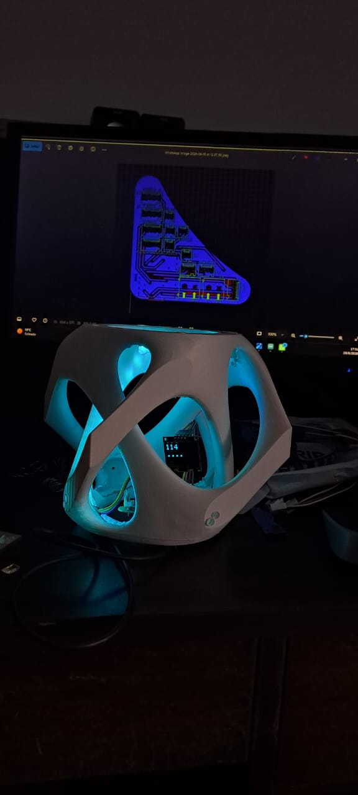
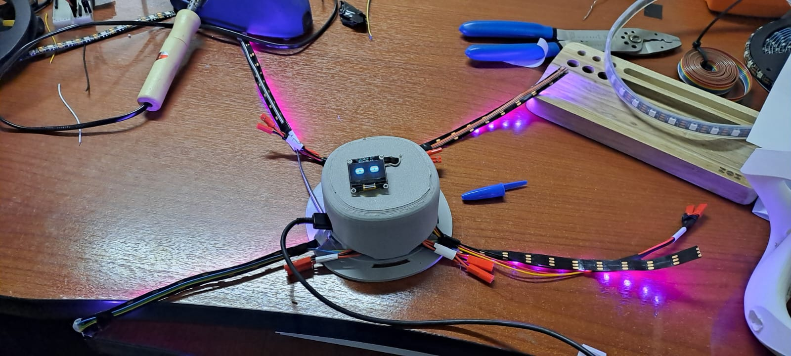

# Fab Vine Node Sprint 4 3D Design Files

Status: final Sprint 4 modeling package  
Source folder: `2. Modelado/updated design june`  
Package date: 2026-06-25  
Primary tools: Rhino 3D and Grasshopper

This folder contains the final Rhino and Grasshopper files for the Sprint 4 physical unit design. It is kept under `BUILD-FILES/3d-designs/` because these are fabrication/design source assets, not firmware, PCB files, or public manual pages.

## Included Files

| File | Type | Purpose |
|---|---|---|
| `rhino/updated_units_june_1V2.3dm` | Rhino model | Final Sprint 4 Rhino model. Stored with Git LFS because it is larger than GitHub's normal file limit. |
| `grasshopper/updated_units_june_1V2.gh` | Grasshopper definition | Final V2 parametric definition paired with the Rhino model. |
| `grasshopper/updated_units_june_1_CLEAN_OFFSETS.gh` | Grasshopper definition | Clean-offset version for reviewing or rebuilding offset logic. |
| `grasshopper/updated_units_june_1_CLEAN_OFFSETS.ghx` | Grasshopper XML definition | Text/XML version of the clean-offset definition for easier diffing and recovery. |
| `media/progress-1.jpeg` | Image | Sprint 4 modeling progress preview. |
| `media/progress-2.jpeg` | Image | Sprint 4 modeling progress preview. |
| `media/progress-3.mp4` | Video | Sprint 4 modeling progress clip. |

## Not Included

The source folder also contained Rhino backup and lock files. These are intentionally not included:

- `*.3dmbak` backup files
- `*.rhl` Rhino lock files

## Preview

Video preview:

[Open Sprint 4 progress video](media/progress-3.mp4)

## Notes For Contributors

- Open the Rhino model first: `rhino/updated_units_june_1V2.3dm`.
- Open the Grasshopper definition that matches the task:
  - Use `updated_units_june_1V2.gh` for the final V2 setup.
  - Use `updated_units_june_1_CLEAN_OFFSETS.gh` or `.ghx` to inspect the clean-offset logic.
- Keep exported fabrication derivatives near the relevant fabrication workflow, not mixed into this source folder.
- If the Rhino model changes, keep it tracked through Git LFS.
