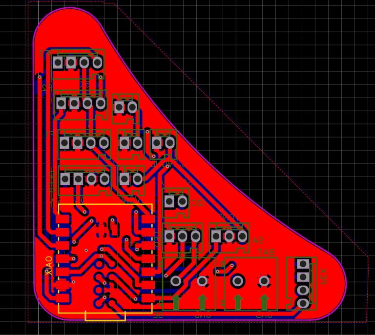
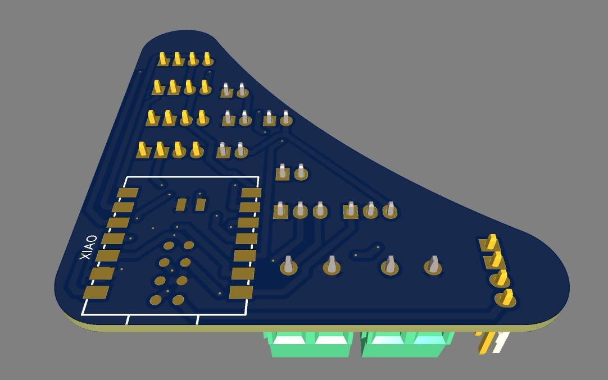

# Fab Vine Node Sprint 4 Integration Notes

Status: documentation and integration sprint  
Sprint date: 2026-06-24  
Board base: Sprint 3 PCB package for Seeed Studio XIAO ESP32-C6  
Firmware base: `NODE-LOGIC/fab-vine-node/V3/`

This folder documents the Sprint 4 hardware integration direction. It does not replace the fabrication files in `BUILD-FILES/pcb-designs/fab-vine-node-sprint3/`. Sprint 3 remains the current board package with Gerbers, previews, schematic, 3D model, and pinout references.

## Correct File Locations

| Content | Location |
|---|---|
| Human-readable sprint manual | `MANUALS/node-sprint4-integration.html` |
| Board fabrication files | `BUILD-FILES/pcb-designs/fab-vine-node-sprint3/` |
| Sprint 4 board integration notes | `BUILD-FILES/pcb-designs/fab-vine-node-sprint4/README.md` |
| V3 firmware | `NODE-LOGIC/fab-vine-node/V3/V3.ino` |
| V3 packet helper | `NODE-LOGIC/fab-vine-node/V3/src/PacketCommunication.h` |

## Board Direction

Sprint 4 keeps the Sprint 3 active TX/RX face-connector direction:

| Function | XIAO pin |
|---|---:|
| Common TX to all faces | `D6` |
| Face 1 / Bottom RX | `D9` |
| Face 2 / Front RX | `D1` |
| Face 3 / Left RX | `D2` |
| Face 4 / Right RX | `D3` |
| Face 5 / Back / Posterior RX | `D8` |
| Face 6 / Top RX | `D7` |
| OLED SDA | `D4` |
| OLED SCL | `D5` |
| LED data | `D10` |

Each face connector should still carry:

```text
GND
TX_COMMON = D6
RX_FACE_n = unique face RX pin
```

When two identical boards connect face-to-face, the connector geometry should cross TX into RX:

```text
Module A GND <----> Module B GND
Module A TX  ----> Module B RX
Module A RX  <---- Module B TX
```

## Visual References

The fabrication images remain in the Sprint 3 board package because those are the actual exported assets. Sprint 4 references them instead of duplicating files.

| Reference | File |
|---|---|
| Top layout preview | `../fab-vine-node-sprint3/previews/pcb-layout-top.jpeg` |
| Bottom layout preview | `../fab-vine-node-sprint3/previews/pcb-layout-bottom.jpeg` |
| Top 3D preview | `../fab-vine-node-sprint3/previews/pcb-3d-top.jpeg` |
| Bottom 3D preview | `../fab-vine-node-sprint3/previews/pcb-3d-bottom.jpeg` |
| Schematic image | `../fab-vine-node-sprint3/schematics/fab-vine-pcb-sprint3-schematic.jpeg` |
| Gerber package | `../fab-vine-node-sprint3/gerbers/Gerber_FabVine_PCB_FabVine_2026-06-01.zip` |
| Sprint 3 pinout workbook | `../fab-vine-node-sprint3/reference/fab-vine-xiao-esp32c6-pinout-sprint3.xlsx` |
| PCB OBJ model | `../fab-vine-node-sprint3/3d-model/OBJ_PCB_FabVine.obj` |

Top layout preview:



Top 3D preview:



## Program Direction

The V3 firmware sends a `PacketData` payload over the common TX line and listens to six RX ports. A face is considered connected when a valid packet arrives on that face. A neighbor is considered lost after 3 seconds without a valid packet.

Current packet payload:

```cpp
struct PacketData {
  uint8_t state;
  uint8_t neighborCount[2];
};
```

Packet framing lives in `PacketCommunication.h`:

```text
START_MARKER 0xAA
payload bytes
checksum complement
END_MARKER 0x55
```

## Interface Direction

Sprint 4 moves the visible node interface beyond debug text:

- OLED eyes show idle, blink, wink, and left/right glance states.
- Face markers show open connection points and disappear when a face is connected.
- LEDs breathe purple when the node is alone.
- LEDs breathe blue/green when the node has neighbors.
- Three or more neighbors make the blue stronger and the breathing period slightly faster.

## Dice-State Logic

`selfState` is the current dice-like state of the node. It starts pseudo-randomly and then moves toward the average state of connected neighbors.

```text
selfState = random(5, 254)
targetValue = average(neighbor states)
selfState = lerp(selfState, targetValue, 0.187)
blinkInterval = selfState * 3
```

This means the node behavior is not binary. Values move gradually through the network, creating a soft synchronization effect between connected modules.

## Validation Checklist

- Test one-to-one board connection and confirm TX/RX crossing works in both directions.
- Confirm all six RX face mappings match the physical connector order.
- Confirm `SoftwareSerial` stability when several faces receive traffic close together.
- Confirm OLED and LED refresh remain smooth while packets are arriving.
- Decide whether `A0` button reset remains in the production board or only in bench testing.
- Validate LED power routing before testing many nodes on the same supply.
