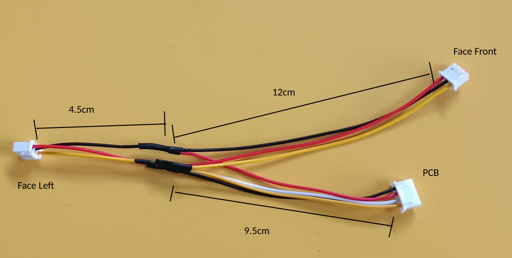

# How to fabricate the face wires

This documents shows how to build the 3 wirings that include the embedded plugs for each face acn connects this with the 3 molex in the PCB for face detection and columniation.

Thus each face needs 3 wires: shared TX (where this node broadcasts), face RX (where it receives the neighbor broadcast), and GND to ensure a reliable serial communication.

### Tools required

| Tool                        | Details                              |
|-----------------------------|--------------------------------------|
| Soldering Iron              | Any that can be used to solder wires |
| Solder Wire                 |                                      |
| Termal Swink wire insulator | Required to seal the cable unions    |
| Wire cutter                 |                                      |
| Wire stripper               |                                      |

<!-- ## Top-Bottom face wire

Build the tree parts: 
- 4 pin molex with 5.5cm of wire
- 3 pin female molex with 10cm of wire
- 3 pin male molex with 19.5cm of wire

Solder based on the schematics: 0

You should end with a cable like this: 

 -->

## Left Front face wire

1 Cut and strip wires: 
- 4pin male molex with 9.5cm of wire
- 3pin male molex with 4.5cm of wire
- 3pin male molex with 12cm of wire

2.1 Connect long wires coming form the same side (V shape): 
- 4pin yellow to 3pin long (12cm) yellow
- 4pin red to 3pin long (12cm) black
- 4pin white to 3pin long(12cm) red

2.2 solder the 2.1 step wires

3.1 Add insulators to the wires

3.2 Connect short wires from the opposite side (Y shape):
- 4pin black to 3pin short (4.5cm) yellow
- 4pin red to 3pin short (4.5cm) black
- 4pin white to 3pin short (4.5cm) red

3.3 Solder and seal the insulators

<!-- ## Right Posterior face wire

Build the parts:
- 4pin male molex with 10.5cm of wire
- 3pin female molex with 12.5cm of wire
- 3pin female molex
 -->