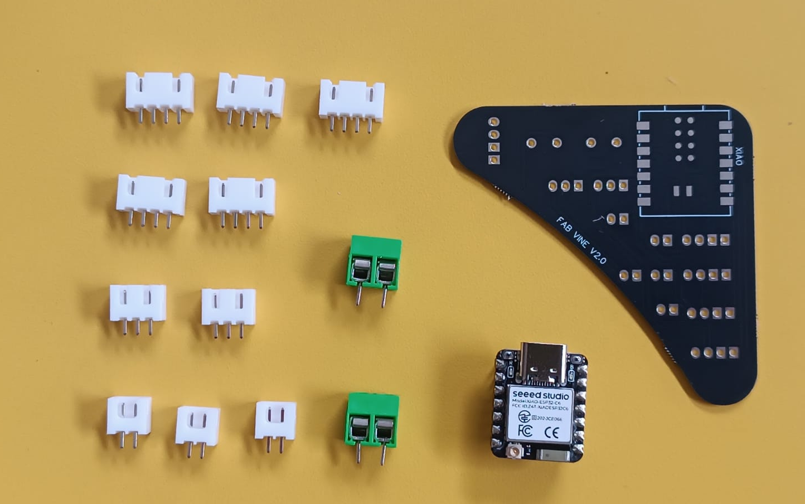
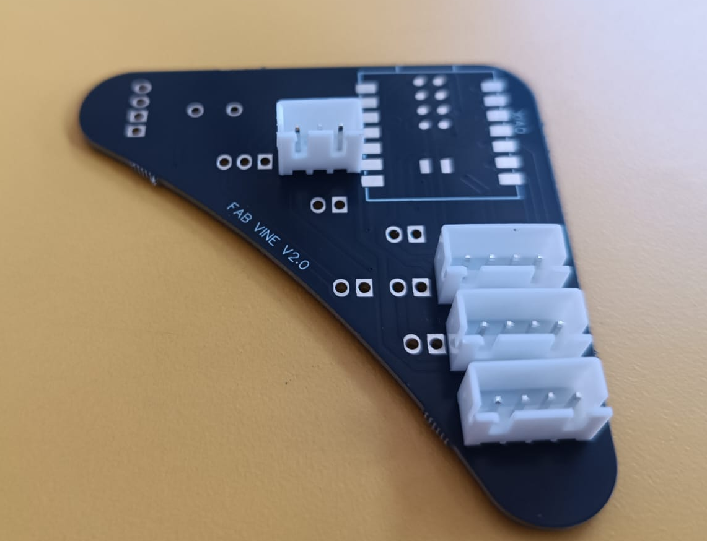
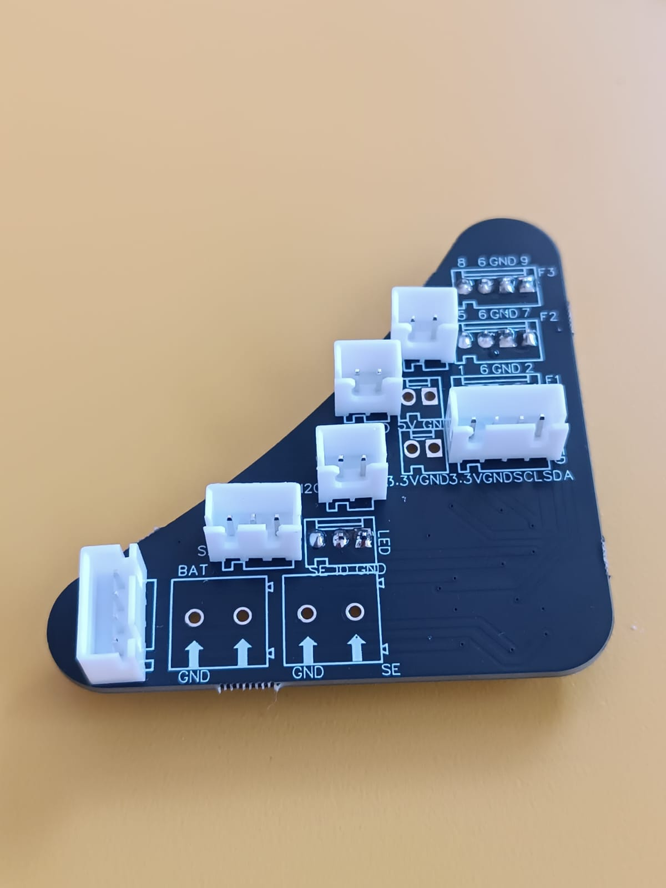
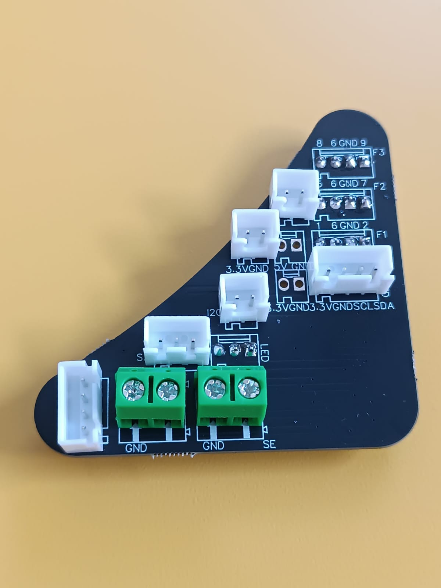

# How to solder and assembly the FabVine PCB v2.0

### BOM
| Amount | Part                 |
|:------:|----------------------|
|   5    | Molex 5 pin          |
|   2    | Molex 3 pin          |
|   3    | Molex 2 pin          |
|   2    | Terminal Block 2 pin |
|   1    | FaBVine PCB 2.0      |

### Tools required

| Tool        |
|-------------|
| Solder Iron |
| Solder Wire |

## 1.- Place the bottom molex

The bottom side of the PCB, faces down in the final assembly, and is recognizable by the XIAO footprint on it:

Place 3 4pin molex headers for the faces (F1,F2,F3), and 1 3pin molex for the LED strip. Notice all the **header openings point to the opposite side of the XIAO USB port**.

## 2.- Place top side Molex 

Flip the board and place the following components:

- 2pin molex for 5v Power
- 2pin molex for 3v power
- 2pin molex for I2C bus
- 3pin molex for A0 sensor
- 4pin molex for I2C Screen
- 4pin molex for PEX bus

Please notice most of the header openings point towards the USB port of the XIAO. Please refer to the image to further verify the correct placement of parts

Flip the board with the help of cardboard or solid surface, solder all the points.

## 3.- Add power terminals

Pass from the upside the 2 power terminals and solder them. Ensure the wire openings are facing the flat border of the PCB 

